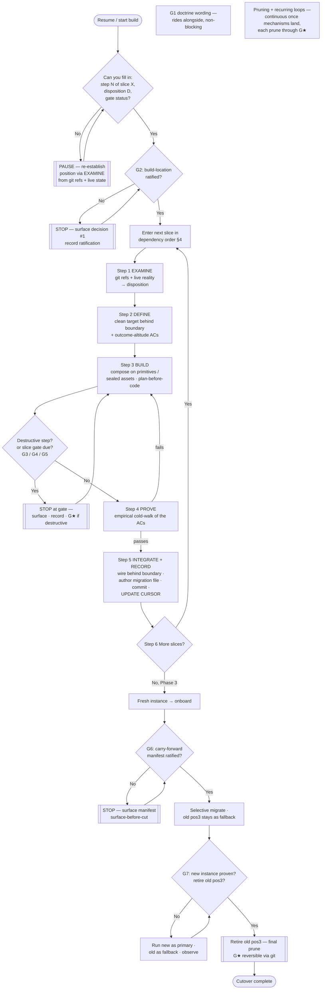

# loam v-next — the build WORKFLOW (how we execute the plan)

**Date:** 2026-05-31
**Status:** WORKFLOW (read-only authoring; nothing is built here)
**Owner:** Luke Ivers
**Companion document:** `docs/plans/loam-vnext-build-plan.md` — the master build
plan. **That plan holds the CONTENT (what to build, phase by phase, with the ACs).
THIS document holds the PROCESS (the steps and state-transitions we move through to
build any one slice of it).** When in doubt about *what* a slice is, read the plan.
When in doubt about *where you are in building it*, read this.

**What this is for.** loam's own build is a real multi-step process. The owner law
`feedback_defined_workflow_in_context_pause_if_lost.md` says real processes must be
written as a FLOW with an explicit current-POSITION — because almost every loam
catastrophe was a *process* failure under stress, not a knowledge failure. This
document is that flow for the v-next build, and it is the prototype of the
"development flow" the Phase-2 workflow system (P2.3) will later formalize. It
dogfoods its own rule: it is a followable flow with a "you are here" capability.

---

## 0. How to use this document (read this first, every time you resume)

1. **Find your position.** Open the position cursor (§5). It names the slice you
   are on and the step inside the per-slice loop you are at. Read it before
   touching anything.
2. **If the cursor is missing, stale, or you cannot tell where you are: PAUSE.**
   Do not improvise a step. Re-establish position from git refs + live state (the
   examine step, §3 step 1, is also how you re-find your place) before proceeding.
   This is the pause-if-lost rule, and it is the single most load-bearing
   behaviour in this document.
3. **Follow the per-slice loop (§3) for the slice you are on.** Each slice walks
   the same six steps. Slices run in the dependency order the plan fixes (§4).
4. **Stop at every gate (§2).** Gates are owner-decision points. You do not pass a
   gate by inferring the owner's answer; you surface, record the ratification, and
   only then proceed.
5. **Update the cursor as you move** (§5). The map is useless without the dot.

---

## 1. The two kinds of steps in this workflow

This flow has exactly two kinds of nodes, and telling them apart is the whole
discipline:

- **Work steps** — things the builder does (examine, define, build, prove,
  integrate-and-record). The builder owns the method; the plan owns the outcome.
  These run autonomously inside an authorized slice.
- **Gates** — owner-decision points where the builder STOPS, surfaces a decision
  with a recommendation, and waits for ratification recorded durably into the
  artefact before moving on. Gates are listed in §2 and shown as diamonds in the
  diagram. A gate is never passed by assumption.

Everything else (the standing rules in §6) is woven through both.

---

## 2. The global gates (owner-decision points — STOP and surface)

These are the decision points where the build halts for the owner. Each is drawn
from the build plan's "what is owner-gated" (plan §9) plus the protection floor.
At every gate: surface the decision + a recommendation, get the answer, **record
the ratification durably into the relevant artefact BEFORE dispatching the work
that depends on it** (record-ratification-before-dispatch), then proceed.

| Gate | What is being decided | When it fires | Plan ref |
|---|---|---|---|
| **G1 — Doctrine wording** | Ratify the exact wording of the doctrine enshrinement (Insert A → VALUE_PROPOSITION, Insert B → CLAUDE.md Lens 0). | Before F0.1 is applied. **Non-blocking** for the rest of the build — it rides alongside. | §9.2, F0.1 |
| **G2 — Build-location decision** | Ratify repo shape (recommended: clean new tree inside the canonical repo) + the physical home of user-state (recommended: `~/.claude/` global + `<workspace>/.loam/` workspace-scoped). | Before F0.2, which BLOCKS all of Phase 1. | §3 decision #1, §9.1 |
| **G3 — Live-activation flip** | Ratify the `~/.claude/settings.json` activation flip that makes the keep-pace read/write hooks run live. Owner-class because it changes runtime behaviour. **One flip** serves both FBM-LIVE (P1.1) and the user-model MVP (P1.5). | Inside the FBM-LIVE slice, at its build step. | §9.3, §6 owner-gate |
| **G4 — Migration release-gate** | Ratify turning on the release-gate that BLOCKS publishing any version without a declared migration file. A process change. | Inside the migration-engine slice (P1.3). | §9.5 |
| **G5 — Openness-default revision** | Ratify reversing `feedback_abstraction_first_default.md`'s `minimal` default to `open` before the user-model MVP seeds it. It is an unratified edit to a Luke-tuned rule. | Before P1.5 seeds the user-model. | §9.4, §7 gap 5 |
| **G6 — Carry-forward manifest** | Ratify which user-state migrates into the fresh instance vs what is left behind (destructive-by-omission → surface-before-cut). | In Phase 3, before selective migration (P3.3). | §9.6 |
| **G7 — Retire old pos3** | Ratify the final prune of the old instance once the new one is proven. The last destructive step. | End of Phase 3 (P3.4), after observed stability. | plan P3.4 |
| **G★ — Any destructive / pruning step** | A standing gate, not tied to one slice: **any** step that removes, compresses, or overwrites user-state must be reversible (git), surfaced before it happens, and dependency-checked ("does anything still depend on this?"). | Whenever a work step would delete/compress/overwrite. | prime-directive memory §"THIRD LEG"; protection floor |

G★ is the protection floor applied to the build itself. The pruning leg is the
most dangerous leg and is *governed by* protection — so the build never silently
cuts. If a work step inside a slice turns out to be destructive, it is promoted to
a G★ gate on the spot.

---

## 3. The per-slice loop (the core flow)

Every slice of the build — FBM-LIVE, the `.loam/` layout, the migration engine,
onboarding, the user-model MVP, and each Phase-2/3 mechanism — walks the same six
steps. This is the reusable loop. You are always at exactly one numbered step of
exactly one slice (that pair is your position, §5).

### Step 1 — EXAMINE (what does loam already have for this slice?)

Establish ground truth about the slice **empirically, from git refs + live
operational reality — NOT from stale docs.** This is the load-bearing lesson of
the whole build: FBM *looked* unbuilt in the dispatch framing but is actually
built-and-sealed yet dark (plan §7 gap 1; seals `0347760`/`32608d2`). **Built ≠
live.** A status line or a roadmap can be stale; the git ref graph and the running
behaviour cannot.

Outputs of EXAMINE → a **build-disposition decision** for the slice:

- **build-new** — nothing usable exists; author it fresh.
- **wire-live** — it is built and sealed but not activated (the FBM case).
- **extend** — a usable base exists; add to it without re-building.
- **leave** — it already does the job; record why and skip to the next slice.

If you cannot determine the disposition from refs + live state, that is a
pause-if-lost condition → halt and re-establish before deciding (§6). EXAMINE is
also the procedure you run to *re-find your position* when the cursor is unclear.

### Step 2 — DEFINE (the clean target behind the boundary)

State what "done" looks like for this slice **behind the framework ↔
user-meaningful-state boundary** (plan §2): framework code on one side, user-state
on the other. Produce **outcome-altitude acceptance criteria** — each verifiable by
invoking the production entry-point with no pre-arranged state (the cold-walk
standard; STUB-class tests do not satisfy them). For FBM-LIVE these are
AC-FBM-LIVE-1..4 already written in plan §6; for later slices, DEFINE authors the
slice's ACs at this step. Method stays the builder's call (ODD).

### Step 3 — BUILD

Build the slice clean, in the structure G2 decided, **composing on Claude
primitives and existing sealed assets wherever they exist** (leverage-Claude /
leverage-loam-first — plan §8 Lens 1). For wire-live and extend dispositions this
is mostly wiring against built parts, not new code. **Plan-before-code:** write the
slice's plan doc to the build-methodology plan path BEFORE any code (the plan's own
discipline). If this step crosses a gate (e.g. FBM-LIVE's activation flip is G3),
stop at the gate first.

### Step 4 — PROVE (the empirical test — never trust "it's wired")

Run the slice's outcome-altitude ACs as a real empirical test. For FBM-LIVE this is
the **two-session cold-walk**: write a fact in a real session A → start a genuinely
new session-B process → assert the fact surfaces (AC-FBM-LIVE-1). **"It's wired" is
not proof; a passing cold-walk is.** This step is the direct guard against the
built-≠-live drift that EXAMINE exists to catch — we close the loop by proving the
slice is now actually live, not merely connected. If PROVE fails, return to BUILD
(or, if the failure reveals the target was wrong, to DEFINE) — do not record the
slice as done.

### Step 5 — INTEGRATE + RECORD

Wire the proven slice in behind the boundary, then make the bookkeeping durable:

- **Author the version's user-state migration file** — the migration release-gate
  (G4, once live) requires every version to declare one; "no-op" is a valid
  declared migration. This is non-optional bookkeeping, not an afterthought.
- **Commit** (new corrective commits, never `--amend`; agents that miss a file add
  a follow-up commit).
- **Update the position cursor** to mark the slice complete and name the next slice
  (§5).

### Step 6 — LOOP

Advance to the next slice in the plan's dependency order (§4). Before starting it,
return to Step 1 (EXAMINE) for that slice — never carry an assumption from the
previous slice into the next one's ground truth.

---

## 4. Slice order (the path the loop walks)

The per-slice loop is applied to these slices in this order. The order is the plan's
fixed critical path (plan §5); it is not re-derived here, only referenced as the
sequence the loop follows.

```
[G2] → FBM-LIVE (P1.1) → .loam/ layout (P1.2) → migration engine + release-gate (P1.3)
                              ↓ (same G3 activation)
                         onboarding/init (P1.4) → user-model MVP (P1.5)
   ── Phase 1 complete ──
   → visibility window (P2.0, early) → [ full user-model / failure-matrix /
       workflow+cursor / adoption-loop / non-tech-recovery — parallel off the kernel ]
   → Phase 3: fresh instance → onboard → [G6] selective migrate → fallback → [G7] retire

G1 (doctrine wording) rides alongside, non-blocking.
Pruning + recurring loops run continuously once their Phase-2 mechanisms land,
each prune passing through G★.
```

**Flagged (F2): the position cursor that THIS workflow uses by hand is the same
mechanism P2.3 builds for real.** The build plan flags the position cursor as the
one genuinely-novel, under-designed piece (plan §7 gap 4; the defined-workflow
memory flags "POSITION-TRACKING needs real design"). Until P2.3 lands, position is
tracked manually per §5. When the loop reaches the workflow-system slice, that slice
should adopt this document and §5's manual cursor as its first real input —
dogfooding all the way down.

---

## 5. Position cursor — the "you are here" dot

The map (this flow) is useless without the dot. Until P2.3 builds a persisted cursor
mechanism, position is tracked **by hand** in a small durable block. Keep one such
block (on disk, e.g. at `<workspace>/.loam/build-cursor.md`, or inline in the build
log) and update it at every step transition:

```
WORKFLOW: loam v-next build
SLICE:    <slice id + name, e.g. "P1.1 FBM-LIVE">
STEP:     <1 EXAMINE | 2 DEFINE | 3 BUILD | 4 PROVE | 5 INTEGRATE+RECORD | 6 LOOP>
DISPOSITION: <build-new | wire-live | extend | leave>   (set at Step 1)
GATE-STATUS: <none pending | awaiting G3 ratification | ...>
UPDATED:  <timestamp>
NEXT:     <the next slice, from §4>
```

**The rule:** at any moment, one must be able to say "I am at step N of slice X,
disposition D, gate G pending/clear." If you cannot fill that sentence in, you are
lost → **PAUSE** (§6) and re-establish via EXAMINE before doing anything else. When
P2.3 lands, this manual block is replaced by the persisted cursor it builds (and this
document becomes one of the flows that system holds in context).

---

## 6. Standing rules woven through every step

These are not steps; they are always-on constraints on the steps above.

1. **Pause-if-lost (the position check).** If you cannot locate where you are in the
   flow, HALT all other work and re-establish position before proceeding — a pilot
   re-fixing location before touching controls. This is the structural answer to the
   process-failure-under-stress class. (`feedback_defined_workflow...` rule part 2.)
2. **Examine-before-building.** Every slice opens with EXAMINE (Step 1). Never build
   against a doc's claim of state; build against git refs + live behaviour. Built ≠
   live. (Prime-directive memory: "examine before building"; plan §7 gap 1.)
3. **Protection governs destructive steps.** Any remove/compress/overwrite is a G★
   gate: reversible, surfaced-before, dependency-checked. Pruning without that guard
   is "a confident hallucination with a delete key." (Prime-directive memory, THIRD
   LEG F2.)
4. **Leverage Claude / existing assets first.** Before building new, ask what built
   primitive or sealed loam asset already does part of the job, and compose on it.
   (Plan §8 Lens 1.)
5. **Record ratification before dispatch.** For every gate (§2), the owner's answer
   is recorded durably into the artefact the builder verifies, BEFORE the dependent
   work is dispatched. Conversational approval is the decision but not yet durable.
6. **Prove, don't trust.** A slice is not done until its outcome-altitude ACs pass an
   empirical cold-walk (Step 4). "It's wired" is never the same as "it works."
7. **This flow is living.** Like everything in loam, this document is pruned (leg 3,
   protection-governed). A stale flow you are forced to follow is worse than none —
   if a step here no longer matches reality, that mismatch is itself a pause-if-lost
   condition: halt, surface, fix the flow (through G★ if the fix removes anything),
   then proceed.

---

## 7. The whole flow in one diagram



---

## 8. What this workflow deliberately does NOT contain (scope discipline)

- It does **not** restate the plan's content — what each slice builds, its detailed
  ACs beyond the FBM-LIVE example, the dependency reasoning, the lens coverage. That
  is the build plan's job (`loam-vnext-build-plan.md`); this document references it.
- It does **not** prescribe method inside a step — *how* to wire FBM, *how* to author
  a migration file. Method is the builder's call (ODD); the plan and the slice's own
  plan-doc carry the buildable detail.
- It builds nothing. It is the process map the builder follows while the plan and the
  per-slice plan-docs carry the buildable content.

---

*Principles applied at authoring: dogfoods the defined-workflow rule (a followable
flow with an explicit "you are here" cursor + pause-if-lost); faithful to the build
plan + the two memories, cited inline; scope-discipline (process only — the plan holds
content, builds nothing); F2 (added the standing G★ destructive-step gate so no prune
in the build can run un-surfaced, and flagged that the position cursor this flow uses
by hand IS the under-designed P2.3 piece the plan calls out).*
